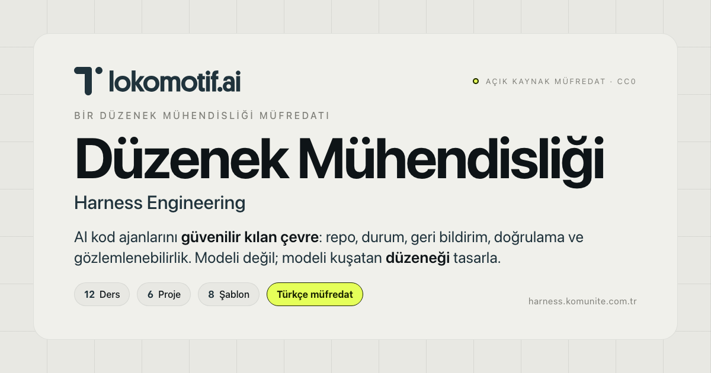

<div align="center">



<br/>
<br/>

<p>
  <strong>AI kod ajanlarını güvenilir kılan çevreyi tasarla.</strong><br/>
  Modeli değil — modeli kuşatan düzeneği (harness).
</p>

<p>
  <a href="https://harness.komunite.com.tr"></a>
  <a href="LICENSE"></a>
  <a href="https://www.mintlify.com"></a>
  
  
</p>

<p>
  <a href="#tez">Tez</a> ·
  <a href="#i̇çerik">İçerik</a> ·
  <a href="#hızlı-başlangıç">Hızlı başlangıç</a> ·
  <a href="#öğrenme-yolu">Öğrenme yolu</a> ·
  <a href="#kaynaklar">Kaynaklar</a> ·
  <a href="#katkı">Katkı</a>
</p>

</div>

---

## Tez

Modern AI kod ajanları — Claude, GPT, Gemini — bir vakum içinde çalışmaz. Bir **düzenek (harness)** içinde çalışır: repo, durum, geri bildirim, doğrulama ve gözlemlenebilirlik. Bir görev başarısız olduğunda refleks, modeli değiştirmek olur; çoğu zaman yanlış katman.

> **Aynı model, farklı düzenek, farklı sonuç.** Modeli değil; modeli kuşatan düzeneği bir mühendislik problemi olarak ele al.

Bu repo, o düzeneği inşa etmenin **Türkçe açık kaynak müfredatıdır**. 12 teorik ders, 6 kümülatif proje, 8 üretime hazır şablon, ve bir skill paketi. Hedef kitle: Claude Code, Codex ve benzeri AI ajanlarla üretim yapan yazılım mühendisleri.

## İçerik

<table>
  <tr>
    <td width="50%" valign="top">
      <h3>12 Ders</h3>
      <p>Her ders bir anti-örüntü teşhisi: <strong>yetkin ajanlar neden başarısız olur</strong>, hangi mekanizma çözer, hangi saha kanıtıyla.</p>
      <p><em>"Aynı Model, Farklı Sonuç" → "Temiz Teslim"</em></p>
      <p><a href="dersler/"><code>dersler/01..12</code></a></p>
    </td>
    <td width="50%" valign="top">
      <h3>6 Proje</h3>
      <p>Kümülatif Notes API üzerinde <code>starter/</code> + <code>solution/</code> zinciri. Her proje önceki çözümün üzerine <strong>bir aparat</strong> ekler.</p>
      <p><em>Kural önceliği → Capstone</em></p>
      <p><a href="projeler/"><code>projeler/01..06</code></a></p>
    </td>
  </tr>
  <tr>
    <td width="50%" valign="top">
      <h3>8 Şablon</h3>
      <p>Kopyala-kullan iskelet: <code>AGENTS.md</code>, <code>PROGRESS.md</code>+<code>DECISIONS.md</code>, <code>Makefile</code>+<code>init.sh</code>, <code>features.json</code>, <code>verifier.md</code>+DoD, sprint+rubrik, OTel trace, session-close.</p>
      <p><a href="kutuphane/"><code>kutuphane/</code></a></p>
    </td>
    <td width="50%" valign="top">
      <h3>Skill Pack</h3>
      <p>Claude Code / OpenClaw uyumlu yetenek paketi. Workflow + recipe + template + script — ajanın kendi reposunda düzenek kurabilmesi için.</p>
      <p><a href="skill-pack/duzenek-yaratici/"><code>skill-pack/duzenek-yaratici/</code></a></p>
    </td>
  </tr>
</table>

## Düzeneğin temel mekanizması

Bir düzenek, modeli **çevre yoluyla** yönlendirir. Beş aparatı vardır:

| Aparat | Sorumluluk |
| --- | --- |
| **Repo** | Tek hakikat kaynağı. Talimat, kod ve karar tarihçesi burada yaşar. |
| **Durum (state)** | Oturumlar arası süreklilik. `PROGRESS.md`, `DECISIONS.md`, init script'leri. |
| **Çalışma zamanı geri bildirimi** | Ajan kendi kodunu test eder, hataları görür, düzeltir. |
| **Öz-doğrulama (self-verification)** | Bağımsız rol ayrımı; halüsinasyon ve "erken zafer ilanı" engellenir. |
| **Gözlemlenebilirlik (observability)** | Her eylem izlenebilir; başarısızlık sessizce gerçekleşmez. |

## Hızlı başlangıç

```bash
git clone https://github.com/komunite/harness-docs.git
cd harness-docs

# Mintlify CLI ile yerel önizleme
npm install -g mint
mint dev
# → http://localhost:3000
```

Search ve AI assistant'ı yerelde etkinleştirmek için `mint login`. İçerik bütünlüğünü doğrulamak için:

```bash
mint validate         # MDX + frontmatter + nav
mint broken-links     # iç linkler çözülüyor mu
```

## Öğrenme yolu

```
       teorik zemin          uygulama          sentez
            │                    │                │
   ┌────────┴────────┐  ┌────────┴────────┐  ┌────┴─────┐
   │   12 Ders       │→ │   6 Proje       │→ │ Capstone │
   │   (dersler/)    │  │   (projeler/)   │  │  Proje 6 │
   └─────────────────┘  └─────────────────┘  └──────────┘
            │                    │
            └──── 8 Şablon ──────┘
                (kutuphane/)
```

1. **[Ders 01 — Yetkin Ajanlar Neden Hâlâ Başarısız Oluyor](dersler/01-yetkin-ajanlar-neden-basarisiz.mdx)** ile teorik zemini kur.
2. **[Proje 01 — Kural Öncelikli](projeler/01-yalniz-prompt-vs-kural-oncelikli.mdx)** ile farkı kendi gözünle gör.
3. Her dersi karşılığındaki projeyle eşleştir. Capstone'a kadar düzenek üzerine düzenek inşa et.

## Repo yapısı

```
.
├── index.mdx                       # giriş
├── dersler/        01..12          # 12 teorik ders
├── projeler/       01..06          # 6 proje (her biri *.mdx + 0N/{starter,solution}/)
├── kutuphane/                      # 8 şablon + genel bakış
├── skill-pack/duzenek-yaratici/    # Claude Code / OpenClaw uyumlu yetenek paketi
├── images/                         # OG cover + brand assets
├── logo/                           # marka logosu
├── style.css                       # marka paleti override
└── docs.json                       # Mintlify konfigürasyonu + SEO/OG
```

## Deploy

Site **Mintlify Cloud** üzerinde host edilir. Üretim deploy'ı yalnızca `main` dalına push olduğunda tetiklenir (otomatik).

- Özel alan adı: **[harness.komunite.com.tr](https://harness.komunite.com.tr)**
- TLS sertifikası Mintlify tarafından otomatik yönetilir
- Search ve AI assistant entegre çalışır

Mintlify yapılandırması [`docs.json`](docs.json) dosyasındadır; SEO ve Open Graph yapılandırması aynı dosyadaki `seo.metatags` bloğundadır.

## Kaynaklar

Müfredat, birincil kaynaklara dayanır. Her ders kullandığı kaynakları **cite eder**.

- Anthropic — *Effective Harnesses for Long-Running Agents*, *Harness Design for Long-Running Apps*, *Infrastructure Noise*
- OpenAI — *Harness Engineering for Codex*
- HumanLayer — *Skill Issue*, *Writing a Good CLAUDE.md*, *12-Factor Agents*
- Thoughtworks / Martin Fowler — düzenek mühendisliği üzerine
- Manus — *Context Engineering*
- OpenHands, LangChain, OpenTelemetry GenAI semconv
- walkinglabs — *Learn Harness Engineering* (ilham veren müfredat, CC0)

## AI ajanlar için

Bu repo aynı zamanda AI kod ajanları için bir **referans projedir**. Kendi reposunda çalışan bir ajan şu üç dosyayı okur:

- **[CLAUDE.md](CLAUDE.md)** — yönlendirici talimat dosyası (sıkı kısıtlar, konu dokümanları haritası, vardiya rutinleri)
- **[MEMORY.md](MEMORY.md)** — projenin yapım hikâyesi, alınmış kararlar, terim haritası, sıradaki adımlar
- **[`skill-pack/duzenek-yaratici/`](skill-pack/duzenek-yaratici/)** — başka bir repoda kullanılmak üzere kopyalanabilen yetenek paketi

## Katkı

Hata raporu, geliştirme önerisi, çeviri — her şey memnuniyetle karşılanır.

| Konu | Yer |
| --- | --- |
| Hata raporu / öneri | [GitHub Issues](https://github.com/komunite/harness-docs/issues) |
| Pull request kuralları | [CONTRIBUTING.md](CONTRIBUTING.md) |
| Davranış kuralları | [CODE_OF_CONDUCT.md](CODE_OF_CONDUCT.md) |
| Güvenlik bildirimi | [SECURITY.md](SECURITY.md) |

## Lisans

[**CC0 1.0 Universal**](LICENSE) — kamu malı. Atıf zorunlu değildir; takdir edilir.

```
Düzenek Mühendisliği (Harness Engineering) — Lokomotif.ai
https://harness.komunite.com.tr
```

## Bağlantılar

- **Site:** [harness.komunite.com.tr](https://harness.komunite.com.tr)
- **GitHub:** [github.com/komunite/harness-docs](https://github.com/komunite/harness-docs)
- **İlham veren müfredat:** [walkinglabs/learn-harness-engineering](https://github.com/walkinglabs/learn-harness-engineering) (CC0)
- **İlgili koleksiyon:** [walkinglabs/awesome-harness-engineering](https://github.com/walkinglabs/awesome-harness-engineering) (CC0)

<div align="center">
  <br/>
  <sub>Düzenek Mühendisliği · Lokomotif.ai · 2026</sub>
</div>
